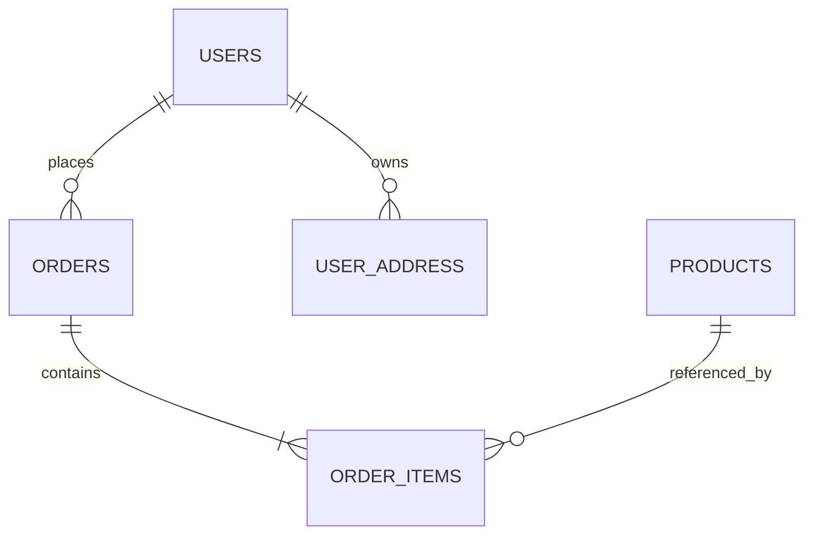

## Overview

UML Copilot consists of a conversation panel on the left, a model canvas in the center, and a toolbar at the top.

### Core Capabilities

#### Excel / CSV Automatic Modeling

After importing an Excel or CSV file, the system can automatically perform the following tasks:

- Identify worksheets
- Generate data tables
- Identify field names
- Infer field types
- Detect primary keys
- Detect foreign-key candidates
- Infer relationships between tables
- Automatically arrange the UML model

#### Natural-Language Editing

Users can describe changes directly in the conversation panel. The system converts those instructions into structured model updates.

Typical supported operations include:

- Add, delete, or rename tables
- Add, delete, or rename fields
- Change field types
- Define primary keys
- Define foreign keys
- Create or remove field relationships
- Change relationship types
- Adjust the model layout

#### Visual UML Canvas

The canvas displays each data table as an individual card.

A table card typically contains:

- Table name
- Primary-key fields
- Foreign-key fields
- Regular fields
- Field types
- Relationship lines
- Relationship cardinalities

Supported relationship types include:

- One-to-one
- One-to-many
- Many-to-one
- Many-to-many
- Self-referencing relationships

#### Model Export

Completed models can be exported as:

- JSON
- Mermaid
- Data model documentation
- Extensible SQL, ORM, or Odoo model code

### Interface Areas

| Area | Main Functions |
|---|---|
| Top toolbar | View table and relationship counts, undo changes, switch languages, and export JSON or Mermaid |
| Left import area | Upload Excel or CSV files |
| Left conversation panel | Add, modify, or delete model content using natural language |
| Central canvas | Display tables, fields, primary keys, foreign keys, and relationships |
| Canvas controls | Zoom, reset, lock, or adjust the view |
| Version history | View and switch between different model versions |
| Minimap | Quickly navigate between areas in a large model |

---

## 3. User Guide

### 3.1 Import a Data File

Click **Import Excel / CSV** in the upper-left corner and select a local file.

The `.xlsx` format is recommended. For simple single-table data, `.csv` files can also be used.

After import, the system performs the following steps:

1. Reads worksheets and column headers.
2. Converts each worksheet into a data table.
3. Uses the first row as field names.
4. Infers field types from sample data.
5. Detects primary-key and foreign-key candidates.
6. Infers relationships between tables.
7. Generates a UML model on the central canvas.

### 3.2 Review the Data Model

After import, each data table is displayed as an individual card.

Icons and visual states generally indicate the following:

| Icon or State | Meaning |
|---|---|
| Key icon | Primary key |
| Link icon | Foreign key or related field |
| No icon | Regular field |
| Line between tables | Field relationship |
| One-to-many / many-to-one | Relationship cardinality |

The canvas supports zooming, panning, and automatic view fitting, making it suitable for large data models.

### 3.3 Modify the Model with Natural Language

Enter an instruction in the conversation box on the left and click Send.

#### Add a Table

```text
Add a Suppliers table with supplier_id, supplier_name, contact_name, phone, and status fields.
```

#### Rename a Table

```text
Rename the Users table to Customers.
```

#### Add a Field

```text
Add a remark field of type text to the Orders table.
```

#### Rename a Field

```text
Rename Products.product_name to name.
```

#### Change a Field Type

```text
Change the field type of Products.price to decimal.
```

#### Delete a Field

```text
Delete the Users.level field.
```

#### Create a Relationship

```text
Link Orders.user_id to Users.user_id.
```

#### Remove a Relationship

```text
Remove the relationship between Orders.address_id and User_Address.address_id.
```

### 3.4 Add a Table Manually

Click **Add Table** above the canvas to create an empty table.

You can then use the conversation panel to define its name and fields:

```text
Rename the new table to Invoices and add invoice_id, order_id, invoice_no, amount, and issue_date fields.
```

### 3.5 Adjust the Canvas

Use the controls in the lower-left corner of the canvas to:

- Zoom in
- Zoom out
- Fit the model to the canvas
- Restore the default view
- Lock or unlock editing

For large models, use the minimap in the lower-right corner to quickly locate a target table.

### 3.6 Undo and Version History

Use the Undo button in the top toolbar to revert the most recent change.

The version history area in the lower-left corner may display versions such as:

```text
v1
v2
v3
```

Version history can be used to:

- Compare models before and after changes
- Restore accidentally deleted tables or fields
- Preserve alternative business designs
- Record requirement review iterations

### 3.7 Export the Model

#### Export as JSON

Click **JSON** in the top toolbar to export the structured model data.

JSON output can be used for:

- Model storage
- Frontend-backend data exchange
- Secondary development
- Database script generation
- ORM model generation
- Odoo model generation

Example:

```json
{
  "tables": [
    {
      "name": "Users",
      "fields": [
        {
          "name": "user_id",
          "type": "integer",
          "primaryKey": true
        },
        {
          "name": "username",
          "type": "string"
        }
      ]
    }
  ],
  "relations": []
}
```

#### Export as Mermaid

Click **Mermaid** in the top toolbar to generate Mermaid ER diagram code.

Example:



Mermaid code can be used directly in:

- GitHub README files
- Gitee README files
- Markdown documents
- Technical design documents
- Project wikis
- Online Mermaid editors

---

## 4. Building the Excel Workbook

To improve recognition accuracy, prepare the Excel file according to a consistent structure before importing it.

### 4.1 Recommended Structure

The recommended convention is:

> One worksheet represents one data table.

Example workbook:

```text
ecommerce_model.xlsx
├── Users
├── User_Address
├── Categories
├── Products
├── Orders
├── Order_Items
├── Payments
└── Logistics
```

The worksheet name is used as the default table name.

### 4.2 Column Headers

The first row of each worksheet should contain field names. Sample data should begin from the second row.

#### Users Worksheet

| user_id | username | email | phone | level | created_at |
|---:|---|---|---|---|---|
| 1 | Alice | alice@example.com | 13800000001 | VIP | 2026-07-01 |
| 2 | Bob | bob@example.com | 13800000002 | Normal | 2026-07-02 |

#### Orders Worksheet

| order_id | user_id | address_id | order_time | total_amount | status |
|---:|---:|---:|---|---:|---|
| 10001 | 1 | 101 | 2026-07-10 10:30:00 | 299.00 | paid |
| 10002 | 2 | 102 | 2026-07-11 14:20:00 | 499.00 | shipped |

### 4.3 Table Naming Conventions

Use one consistent naming style, such as:

```text
Users
User_Address
Order_Items
```

or:

```text
users
user_address
order_items
```

Recommendations:

- Use English names
- Avoid spaces
- Avoid special characters
- Keep singular/plural conventions consistent
- Avoid mixing Chinese, English, and pinyin
- Use names that clearly describe the business entity

Not recommended:

```text
Table1
Sheet1
User Table
order-items!
```

### 4.4 Field Naming Conventions

The lowercase snake_case convention is recommended:

```text
user_id
product_name
order_time
total_amount
created_at
```

Recommendations:

- Name a primary key as `singular_table_name_id`
- Keep foreign-key names consistent with the referenced primary key
- Use `_time`, `_date`, or `_at` for date and time fields
- Use `status` consistently for status fields
- Use `is_`, `has_`, or `enable_` prefixes for Boolean fields

Examples:

```text
is_default
is_active
has_invoice
created_at
updated_at
```

### 4.5 Field Type Inference

The system infers field types from the content in Excel.

| Excel Content | Recommended Inferred Type |
|---|---|
| 1, 2, 3 | integer |
| 12.5, 299.00 | decimal / float |
| User names, addresses, descriptions | string / text |
| 2026-07-24 | date |
| 2026-07-24 10:30:00 | datetime |
| TRUE / FALSE | boolean |

To avoid incorrect inference, sample values within the same column should use a consistent data type.

Not recommended:

| amount |
|---|
| 100 |
| 200.5 |
| N/A |
| Undetermined |

Recommended:

| amount |
|---:|
| 100.00 |
| 200.50 |
| 0.00 |
| 350.00 |

### 4.6 Primary-Key Design

Each table should have a unique primary key.

Examples:

```text
Users.user_id
Products.product_id
Orders.order_id
Payments.payment_id
```

A primary key should be:

- Unique
- Non-null
- Type-stable
- Unlikely to change with business content

Names, phone numbers, and product names should not normally be used directly as primary keys.

### 4.7 Null Values and Sample Data

The system may use sample data to infer field types and relationships. Each worksheet should therefore contain approximately 2–10 valid sample rows.

Important guidelines:

- Do not merge cells
- Do not place description rows above the header
- Do not place multiple independent tables in one worksheet
- Do not use colors as the only representation of field meaning
- Do not insert summary or total rows in the data area
- Avoid completely empty columns
- Use a consistent date format

### 4.8 Multi-Worksheet Excel Example

```text
Users
  user_id
  username
  email

Products
  product_id
  category_id
  product_name
  price

Orders
  order_id
  user_id
  order_time
  total_amount

Order_Items
  item_id
  order_id
  product_id
  quantity
  unit_price
```

After import, the system can generate a model containing relationships among users, products, orders, and order items.

---

## 5. Field Relationships

Field relationships describe data dependencies between tables.

### 5.1 Primary Keys and Foreign Keys

A primary key uniquely identifies a record.

Example:

```text
Users.user_id
```

A foreign key references the primary key of another table.

Example:

```text
Orders.user_id -> Users.user_id
```

This relationship means that each order belongs to one user.

### 5.2 One-to-One Relationships

One record in the primary table corresponds to at most one record in the related table.

Example:

```text
Users.user_id -> User_Profile.user_id
```

Typical use cases:

- User and user profile
- Employee and employee extension information
- Order and unique invoice

Natural-language instruction:

```text
Define a one-to-one relationship between Users.user_id and User_Profile.user_id.
```

### 5.3 One-to-Many Relationships

One record in the primary table can correspond to multiple records in the related table.

Example:

```text
Users.user_id -> Orders.user_id
```

This means that one user can have multiple orders.

```text
Orders.order_id -> Order_Items.order_id
```

This means that one order can contain multiple order items.

Natural-language instruction:

```text
Create a one-to-many relationship between Users and Orders using Users.user_id and Orders.user_id.
```

### 5.4 Many-to-One Relationships

A many-to-one relationship is the reverse perspective of a one-to-many relationship.

Examples:

```text
Multiple Orders records -> One Users record
```

```text
Multiple Products records -> One Categories record
```

Natural-language instruction:

```text
Set Products.category_id as a foreign key referencing Categories.category_id.
```

### 5.5 Many-to-Many Relationships

A many-to-many relationship is normally implemented through a junction table.

For example, Orders and Products are connected through `Order_Items`:

```text
Orders
  |
  | 1:N
  |
Order_Items
  |
  | N:1
  |
Products
```

Corresponding fields:

```text
Order_Items.order_id -> Orders.order_id
Order_Items.product_id -> Products.product_id
```

Natural-language instruction:

```text
Use Order_Items as the junction table to create a many-to-many relationship between Orders and Products.
```

### 5.6 Self-Referencing Relationships

A table can also reference itself.

Example of a category hierarchy:

```text
Categories.parent_id -> Categories.category_id
```

This means that a category can have one parent category and multiple child categories.

Natural-language instruction:

```text
Link Categories.parent_id to Categories.category_id to create a hierarchical category structure.
```

### 5.7 Relationship Detection Rules

The system can infer relationships from the following characteristics:

- Matching field names
- Fields ending in `_id`
- Foreign-key names that correspond to table names
- Clear value containment between two columns
- Semantic correspondence between worksheet names and field names

Example:

```text
Orders.user_id
Users.user_id
```

The system may infer:

```text
Orders.user_id -> Users.user_id
```

### 5.8 Relationship Design Recommendations

When creating relationships, ensure that:

- Primary-key and foreign-key types are consistent
- Foreign-key names have clear business meaning
- Duplicate relationships are not created
- Many-to-many relationships use a junction table
- Unstable business fields are not used as relationship keys
- Existing relationships are reviewed before deleting a field
- Foreign keys are updated when a referenced primary key is renamed

---
