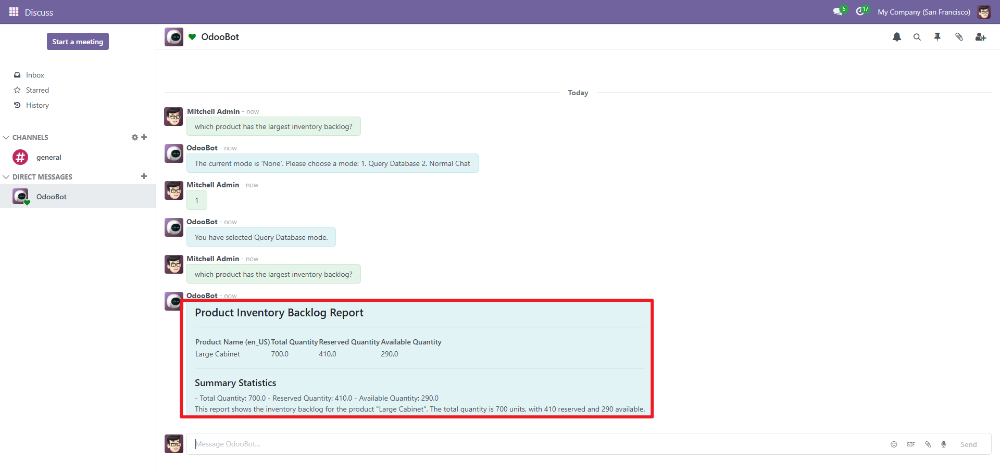

Auto-SQL can significantly boost business analysis in Odoo by leveraging real-time data across modules to detect anomalies, predict sales trends, optimize inventory levels, and generate intelligent insights that streamline decision-making and improve overall operational efficiency.

AI can optimize Odoo’s Inventory module by forecasting demand, minimizing stockouts and overstock situations, and automating replenishment decisions based on real-time consumption patterns and historical trends."

Share documents with your friends! Send work or school projects from your computer or phone.

To share a document:

1. Open a message with someone
2. Select the **Send Media** button
3. Pick a document

> Changes made to documents after sending are not saved back, you'll have to get contacts to send you updated versions.

