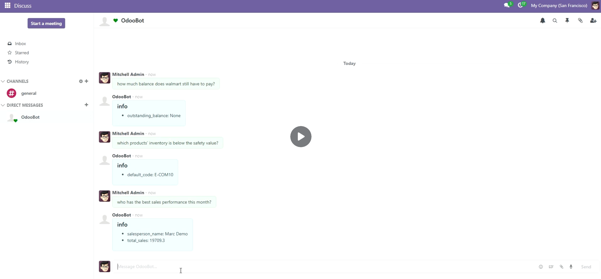

This is the **User Manual** for Auto-SQL Odoo Addon.

**Auto-SQL Odoo Addon** is a powerful solution for automating your sales process. By integrating a large language model with your local database, it enables your chatbot to deliver accurate and intelligent responses to customer inquiries. Whether it's sales questions, shipment tracking, product specifications, or accounting information, the system provides fast, context-aware answers—streamlining communication and enhancing customer satisfaction.

> Auto-SQL seamlessly integrates with WhatsApp, Telegram, and other popular messaging platforms.

### Getting Started

Getting your Chatbot Up and Running with Auto-SQL is fast and easy:

1. Download the Auto-SQL add-on;

2. Install it on your Odoo server;

3. Configure it with your preferred large language model (LLM).

With just a few simple steps, your AI-powered Odoo assistant will be ready to serve.

### Features

Explore more of Auto-SQL by reading about our features:

#### Sales

Auto-SQL is ready to handle inquiries related to your products, including pricing, availability, and detailed product information. It can also assist with customer support and order tracking, providing a seamless and intelligent user experience across platforms like WhatsApp, Telegram, and more.

#### Customer Support

Auto-SQL chatbots can handle common support queries across modules like CRM, Inventory, and Accounting—providing instant, accurate answers 24/7. By analyzing user behavior and historical data within Odoo, AI can personalize responses, suggest relevant documentation, and even predict potential issues before they arise. Moreover, Auto-SQL helps support teams prioritize tickets based on urgency and customer sentiment, allowing human agents to focus on more critical or nuanced problems. This leads to quicker resolutions, improved user satisfaction, and a more scalable support infrastructure for growing businesses.

#### Business Analysis

Auto-SQL can provide powerful business insights for companies using Odoo by analyzing the vast amount of structured and unstructured data generated across its integrated modules. From sales trends and inventory turnover to customer behavior and financial performance, Auto-SQL can uncover hidden patterns and correlations that inform smarter decision-making. By leveraging machine learning algorithms, companies can forecast demand, identify operational bottlenecks, and even detect anomalies in real time—helping prevent losses and optimize resource allocation. Auto-SQL also enables personalized dashboards and automated reports within Odoo, giving business owners and managers actionable insights tailored to their goals, all without manual data crunching.

> More information can be found at https://www.auto-sql.com

