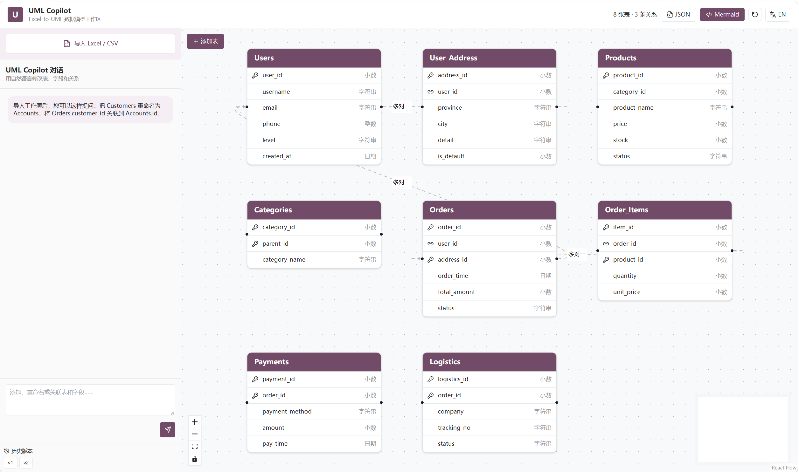

UML Copilot

> 面向业务分析、系统设计与 Odoo/ERP 实施场景的 AI 数据模型设计工具。

UML Copilot 是一款将 Excel/CSV 数据表、UML 数据模型与自然语言交互 融合在一起的可视化建模工具。用户可以导入已有表结构，在画布中查看表、字段及关联关系，并通过对话方式完成表重命名、字段调整、关系建立和模型优化，帮助业务人员、产品经理与开发人员快速形成统一、清晰、可执行的数据模型。

项目定位

传统数据库建模工具通常要求用户熟悉 SQL、ER 图和建模规范，而业务人员更习惯使用 Excel 描述数据。UML Copilot 通过“导入表格 + 图形化建模 + AI 对话修改”的方式，降低数据模型设计门槛，并减少需求沟通、模型整理和开发交接过程中的信息损失。
该工具适用于：

Odoo、ERP、CRM、WMS、SCM 等业务系统的数据建模Excel 表结构向数据库模型或 UML 图的转换产品需求分析与业务对象梳理数据库表、字段、主外键及关联关系设计业务人员与开发人员之间的模型确认与交付项目早期原型设计和数据结构评审核心能力Excel / CSV 导入支持导入现有 Excel 或 CSV 文件，并将工作表、列名和数据类型转换为可视化数据表模型。用户无需手工逐张创建数据表，即可快速完成初始建模。

可视化 UML 建模

每张数据表以独立卡片形式展示，内容包括：
表名
字段名
字段类型
主键
外键
表之间的关联关系
用户可以在画布中拖动表的位置，调整模型布局，并直观查看系统中的数据流向与依赖关系。
AI 对话式修改

用户可以直接使用自然语言修改模型，例如：

将 Customers 表重命名为 Accounts。

给 Orders 表增加 approval_status 字段，类型为字符串。

将 Orders.customer_id 关联到 Accounts.id。

删除 Products 表中的 description 字段。

为 Users 和 Roles 建立多对多关系。

AI Copilot 会解析用户意图，并将修改同步到右侧模型画布中。

表与字段管理
支持常见的数据模型操作：
新增、删除和重命名数据表
新增、删除和修改字段
设置主键和外键
修改字段类型
调整字段顺序
补充字段说明
检查重复字段和命名冲突
关系设计
支持建立和展示常见数据关系：
一对一
一对多
多对一
多对多
自关联
关系线可显示关联方向与关系类型，便于快速理解表之间的业务依赖。
模型导出
模型可导出为适合开发、评审和文档沉淀的格式，例如：
JSON
Mermaid
UML/ER 图描述
数据字典
SQL 建表结构
具体导出能力可根据项目版本进行扩展。
历史版本与撤销
支持记录模型修改历史，用户可以查看不同版本，并在误操作后撤销或恢复到指定版本。

界面说明
UML Copilot 的工作区主要由以下区域组成：
左侧：导入与 AI 对话区
左侧区域用于：
导入 Excel 或 CSV 文件
输入自然语言修改指令
查看 AI 对模型的处理结果
切换历史版本
中间：UML 模型画布
中间区域用于：
展示数据表和字段
查看主键、外键与数据类型
展示表之间的关系
拖拽调整表的位置
缩放和定位模型
顶部：模型操作区
顶部工具栏可用于：
查看当前表数量和关系数量
新增数据表
导出 JSON
导出 Mermaid
撤销操作
切换界面语言
右下角：模型导航区
当模型规模较大时，可通过缩略图快速定位画布中的不同区域。

基本使用流程

```mermaid
flowchart LR
    A[导入 Excel / CSV] --> B[识别工作表与字段]
    B --> C[生成 UML 数据模型]
    C --> D[通过 AI 对话修改]
    D --> E[检查表、字段与关系]
    E --> F[导出模型或交付开发]
```

推荐操作步骤：
准备包含表结构的 Excel 或 CSV 文件。
点击“导入 Excel / CSV”。
检查系统生成的表名、字段名和字段类型。
在左侧对话框中输入修改要求。
在右侧画布中确认修改结果。
调整表的位置和关系布局。
导出 JSON、Mermaid、数据字典或开发模型。
Excel 文件建议格式
推荐每个工作表对应一张数据表，第一行为字段名。
示例：`Users` 工作表
user_id	username	email	phone	level	created_at
1	Alice	alice@example.com	13800000000	admin	2026-07-01
建议遵循以下规则：
工作表名称使用业务对象名称
第一行使用清晰、唯一的字段名
主键字段建议使用 `id` 或 `<table>_id`
外键字段建议使用 `<related_table>_id`
避免空列、合并单元格和重复字段名
日期、数字和布尔值尽量保持格式统一
典型应用示例
以电商业务为例，系统可以识别并展示以下数据对象：
Users：用户信息
User_Address：用户地址
Categories：商品分类
Products：商品信息
Orders：订单
Order_Items：订单明细
Payments：支付记录
Logistics：物流信息
模型中可建立如下关系：
一个用户拥有多个地址
一个用户可以创建多个订单
一个订单包含多个订单明细
一个商品可以出现在多个订单明细中
一个订单对应支付记录和物流记录
一个分类包含多个商品
使用价值
对业务人员
无需掌握数据库语法，即可使用熟悉的 Excel 和自然语言描述业务对象与关系。
对产品经理
可以在需求阶段快速整理业务实体，减少 PRD、流程图和数据库设计之间的不一致。
对开发人员
可获得结构清晰的数据模型、字段定义和关联关系，降低需求理解与返工成本。
对实施团队
适合用于 Odoo、ERP 等项目的前期调研、数据模板设计、模型确认和客户沟通。
项目特点
低门槛：从 Excel 和自然语言开始建模
可视化：表、字段和关系集中展示
可交互：支持拖拽、缩放、编辑和版本管理
AI 辅助：通过对话快速修改模型
易交付：支持导出标准化模型描述
可扩展：可继续接入流程设计、权限配置和 Odoo 模块生成能力
后续规划
计划进一步支持：
Excel 自动识别主键、外键与枚举字段
表结构质量检查与命名规范检查
自动生成 SQL 建表语句
自动生成 Odoo Model、View 与 Access Control 文件
字段级权限和角色可见性设计
表单与业务流程节点绑定
从 UML 模型生成可交互业务原型
模型差异比较与版本审计
团队协作、评论和在线评审

项目状态
当前版本主要用于展示 UML Copilot 的产品概念、交互流程和数据建模方式。部分功能可能仍处于原型验证或持续开发阶段，实际能力以当前部署版本为准。
贡献与反馈
欢迎提交功能建议、问题反馈和改进方案。建议在提交问题时说明：
使用场景
导入文件格式
预期结果
实际结果
截图或复现步骤

License
本项目的开源协议、商业使用范围及二次开发授权方式，可根据实际发布方案补充。
---
UML Copilot — 让业务数据模型从 Excel 中产生，在对话中完善，并以可视化方式交付。

