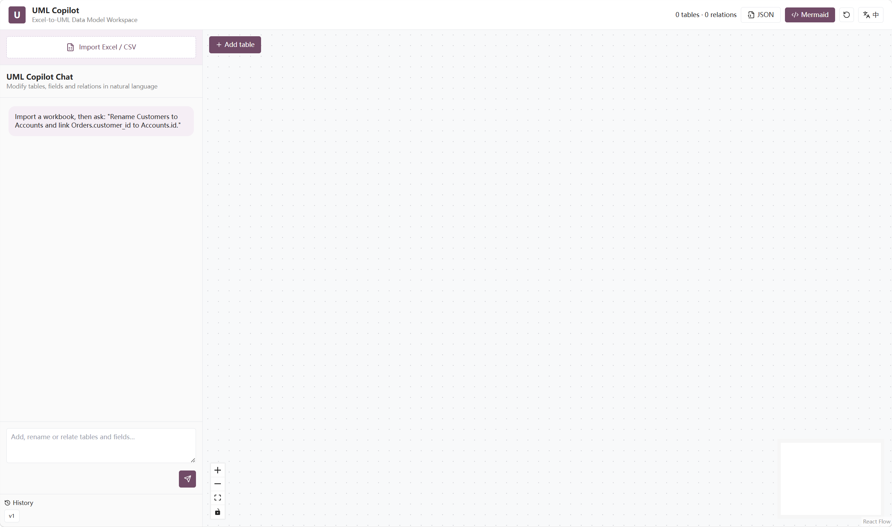
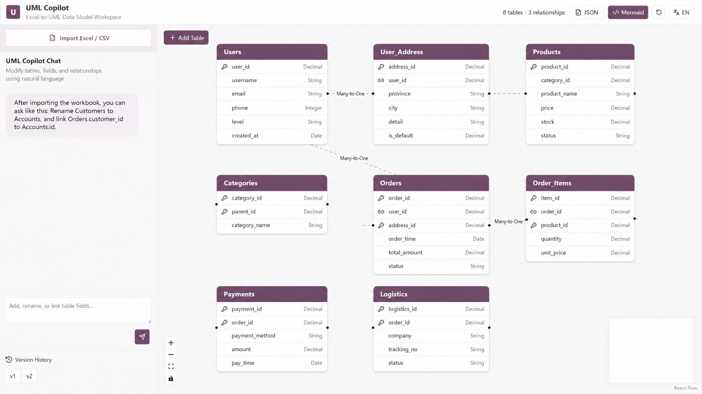

**UML Copilot**

> An Excel-to-UML data modeling workspace designed for business users, product managers, implementation consultants, and developers.
> 
> Import Excel/CSV files, modify models through natural-language instructions, and visually manage tables, fields, and relationships.

**Introduction**

UML Copilot is a visual modeling tool for database schema design and business data modeling.

Users can import existing Excel or CSV files. The system automatically identifies worksheets, field names, field types, primary keys, foreign keys, and potential relationships, and then generates an interactive data model diagram on the canvas.

In addition to conventional drag-and-drop editing, UML Copilot supports model modification through natural-language instructions. For example:

Rename the Customers table to Accounts.

Link Orders.customer_id to Accounts.id and define it as a many-to-one relationship.

Add a description field of type text to the Products table.

UML Copilot is suitable for the following scenarios:

- Database prototyping
- Data modeling for ERP, CRM, WMS, SCM, and other business systems
- Odoo module, model, and field relationship design
- Data structure review before Excel import
- Legacy database schema documentation
- Product requirement review and engineering communication
- Data relationship visualization
- Data model documentation generation

[Download the Excel file](https://openerp-hk-t.github.io/doc/Template_English.xlsx)
